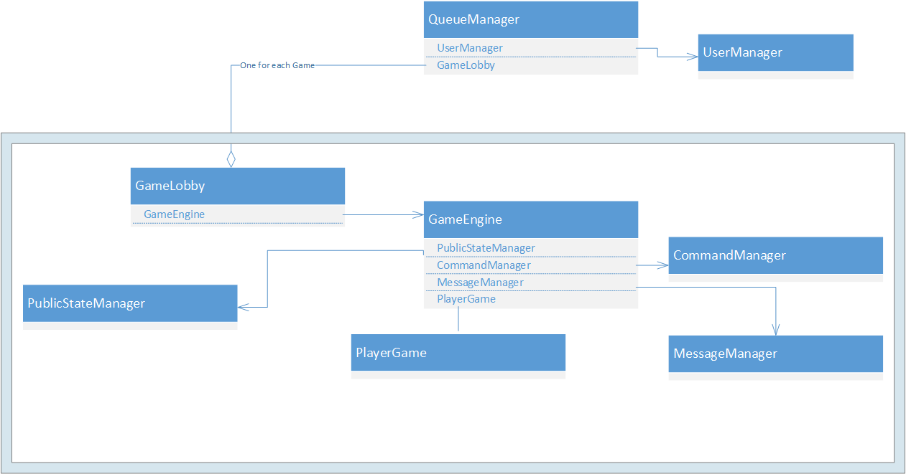

# Game Engine
Located under *server/Mafia*

---
All of the game logic and the bulk of the project work is encapsulated in the game engine code.
### Design Goals

1. **Encapsulate logic and maintain separation of concerns.**
    * Logic is separated into various Manager objects, each with unique responsibilities, states, and public interfaces.

2. **In-depth gameplay and extensible game mechanics.**
    * Design of player objects and the command event priority queue allows each role to have nuanced interactions with other roles, players, and the game state at all phases of the game.
    * When adding a new mechanic to a role, the role class only has to implement a common interface which will be used by the Command Manager.

3. **Consistent and balanced gameplay.**
    * There is a framework of rules for game mechanics that all roles must follow. These rules assign roles and actions to functional categories and game stages which have different priorities for effect precedence.
    * The framework still allows for a large degree of freedom in adding new mechanics.

4. **Narrow connection with Socket.IO**
    * The GameEngine should minimize interactions with Socket.io and the network connection, allowing flexibility in network protocols and libraries.

5. **Automatic placement of players into open games.**
    * A singleton QueueManager manages the matchmaking queue and ensures that players are placed into games on a first-come first-serve basis. QueueManager spawns new instances of game lobbies.

The key components of the game engine are diagrammed below.

####QueueManager
Responsible for managing open games and connected players. Creates new game lobby if a player connects and there is no open game. Spawns Game Lobbies.

####UserManager
Responsible for managing all connected users, generating their names, and mapping sockets to user objects.

####GameLobby
Responsible for managing unique Socket.io namespace for the game, and for adding/removing players. One instance per game.

####GameEngine
Spawned by Game Lobby. Responsible for game state, player states, and game mechanics resolution.

####MessageManager
Responsible for interfacing with Socket.io and relaying commands/chat messages within the game's namespace to GameEngine instance.

####PlayerGame
Responsible for containing player info and state. Initialized with role. Exposes interface for action interaction.

####PublicStateManager
Responsible for maintaining the public state for each player. The public state is the data that will be pushed out to each player's client when the state changes.

####CommandManager
Responsible for the actions priority queue. Queues up actions as they occur at night, then resolves actions at end of turn. Actions called during day with "immediate" flag will be resolved immediately.

####Role objects
Role objects are located under ./roles
They serve to define the state, win conditions, and actions of a role.

####Config
An object for defining configuration parameters, can be instantiated for each game to configure the game. This class needs work.
